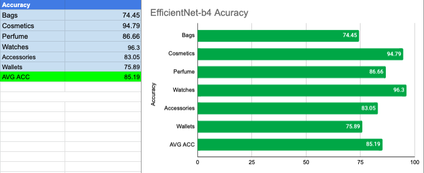

# Fashion-Hiernet
Fashion-Hiernet is a hierarchical image classification model for fashion commerce items based on **EfficientNet-b**4 and **LCPN (Local Classifier per Parent Node)** technique. This particular implementation is designed for level-2 hierarchy datasets, but I'm working on making it available for deeper datasets in the future! For more details on LCPN technique, refer to [this wonderful article](https://towardsdatascience.com/hierarchical-classification-with-local-classifiers-down-the-rabbit-hole-21cdf3bd2382)!

## venv setup

```bash
python3 -m venv venv
source ./venv/bin/activate
pip3 install -r requirements.txt
```

## Usage

### Dataset Preparation

First, prepare a level-2 hierarchy dataset organized in the following structure.
```
./dataset
├── parent_class_1
│   ├── child_class_1
│   │    ├── img_0001.jpg
│   │    ├── img_0002.jpg
│   ├── child_class_2
│   │    ├── img_0001.jpg
│   │    ├── img_0002.jpg
├── parent_class
│   ├── child_class_3
│   │    ├── img_0001.jpg
│   │    ├── img_0002.jpg
│   ├── child_class_4
│   │    ├── img_0001.jpg
│   │    ├── img_0002.jpg
│   │    ├── etc. . .
```
Refer to [dataset_example](/dataset_example) for the directory structure used for our specific application of classifying CHANEL items.

Then, run the following script:
```bash
python3 prepare_dataset.py -p ./dataset_example
```
This script will prepare all datasets to train each local classifier under `split_datasets` folder.
For our [dataset_example](/dataset_example), the script created 7 different datasets split into training and validation set; 1 parent classification model and 6 child classification models.

### Train Classifier

```bash
cd fashion-net/src
chmod +x ./train_lcpn.sh
./train_lcpn.sh
```
This script will train all models consecutively from datasets in `split_datasets` folder. All of following output files will be saved in `fashion-net/trained_models` folder.
```
trained_models
├── accessories
│   ├── bin
│   │   ├── encoder.pickle
│   │   ├── inv_normalize.pickle
│   │   └── test_transforms.pickle
│   ├── class_plot.png
│   ├── confusion_matrix.png
│   ├── error_plot.png
│   ├── model.pth
│   ├── performance.txt
│   └── wrong_plot.png
├── bags
├── cosmetics
├── parent
├── perfume
├── wallets
└── watches
```

### Predict

```bash
cd fashion-net/src/
python3 predict.py -p RELATIVE_PATH_TO_IMAGE
```
Pass in the path to the image you wish to predict on, and this script will perform a two-stage prediction: Parent class & Child class.

1. Parent Class Prediction -> Classified as "bags"
2. Load encoder and model for "bags" child_class
3. Child Class Prediction -> Classified as "bags_boy"
```
(venv) root@server:~/fashion-net/src# python3 predict.py -p ../sample_images/bags_boy.jpg
=======Phase 1: Parent Class Prediction========
Loading pkl files...
ENCODER:  {0: 'accessories', 1: 'bags', 2: 'cosmetics', 3: 'perfume', 4: 'wallets', 5: 'watches'}
Loading model.pth...
Forward Passing...
Predicting Label...
Parent class prediction:  bags
=======Phase 2: Child Class Prediction========
Loading pkl files...
ENCODER:  {0: 'bags_19', 1: 'bags_2.55', 2: 'bags_22', 3: 'bags_boy', 4: 'bags_gabrielle', 5: 'bags_pouches', 6: 'bags_timeless'}
Loading model.pth...
Forward Passing...
Predicting Label...
Final Prediction:  bags_boy
```

## Results & Performance



Avg. Acc: 85.19%


## License
[MIT](https://choosealicense.com/licenses/mit/)
